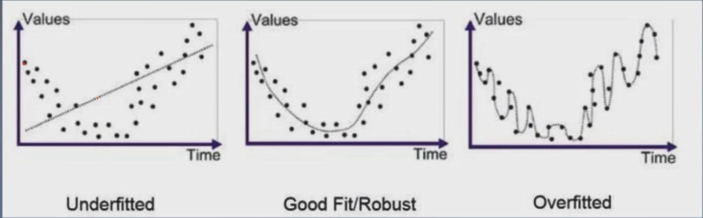

# 线性回归方法简介

## 形式化定义
+ 假设函数（hypotheses function）  
$$h_{\theta}(x)=\sum_{i=0}^{n} \theta_{i} x_{i}=\theta^{T} x$$  其中  x_{0}=1 
+ 损失函数（loss function）  
$$L(\theta)=\left(h_{\theta}(x)-y\right)^{2}$$
+ 代价函数（cost function）  
$$J(\theta)=\frac{1}{2 \mathrm{m}} \sum_{i=1}^{m}\left(h_{\theta}\left(x^{(i)}\right)-y^{(i)}\right)^{2}$$

# 梯度下降法（Gradient Descent）
+ 随机初始化&\theta&
+ 设置步长&\alpha&, 设置迭代次数&\m&
+ 求&J(\theta)&的导数$\nabla J(\theta)$
+ $\begin{array}{l}
\text { for } i=0 \text { to } m \text { : } \\
\qquad \theta:=\theta-\alpha \nabla J(\theta)
\end{array}$

# 使用梯度下降法求解线性回归问题
+ 代价函数
$$J(\theta)=\frac{1}{2 \mathrm{m}} \sum_{i=1}^{m}\left(h_{\theta}\left(x^{(i)}\right)-y^{(i)}\right)^{2}$$
+ 求解
$$\displaylines{ \begin{array}{l}
\frac{\partial}{\partial \theta_{j}} J(\theta)=\frac{\partial}{\partial \theta_{j}} \frac{1}{2 m} \sum_{i=1}^{m}\left(h_{\theta}\left(x^{(i)}\right)-y^{(i)}\right)^{2} \\
=2 * \frac{1}{2 m} \sum_{i=1}^{m}\left[\left(h_{\theta}\left(x^{(i)}\right)-y^{(i)}\right) \frac{\partial}{\partial \theta_{j}}\left(h_{\theta}\left(x^{(i)}\right)-y^{(i)}\right)\right] \\
=\frac{1}{m} \sum_{i=1}^{m}\left[\left(h_{\theta}\left(x^{(i)}\right)-y^{(i)}\right) \frac{\partial}{\partial \theta_{j}}\left(\sum_{f=0}^{n} \theta_{f} x_{f}^{(i)}-y^{(i)}\right)\right] \\
=\frac{1}{m} \sum_{i=1}^{m}\left[\left(h_{\theta}\left(x^{(i)}\right)-y^{(i)}\right) x_{j}^{(i)}\right] \\
\theta_{j}:=\theta_{j}+\alpha \frac{1}{m} \sum_{i=1}^{m}\left(y^{(i)}-h_{\theta}\left(x^{(i)}\right)\right) x_{j}^{(i)}
\end{array}}$$

# 梯度下降类型
## 批量梯度下降（Batch Gradient Descent, BGD）
$$\theta_{j}:=\theta_{j}+\alpha \frac{1}{m} \sum_{i=1}^{m}\left(y^{(i)}-h_{\theta}\left(x^{(i)}\right)\right) x_{j}^{(i)}$$
## 随机梯度下降(Stochastic Gradient Descent, SGD)
$$\theta_{j}:=\theta_{j}+\alpha\left(y^{(i)}-h_{\theta}\left(x^{(i)}\right)\right) x_{j}^{(i)}$$
## 小批量梯度下降(Mini-Batch Gradient Descent, MBGD)
+ 每次取batch-size个样本进行更新
$$\theta_{j}:=\theta_{j}+\frac{\alpha}{\text { batch-num }} \sum_{i=1}^{\text {bact }}\left(y^{(i)}-h_{\theta}\left(x^{(i)}\right)\right) x_{j}^{(i)}$$

# 评价指标
## 均方误差（MSE）
$$M S E=\frac{1}{m} \sum_{i=1}^{m}\left(y^{(i)}-\hat{y}^{(i)}\right)^{2}$$
## 均方根误差（RMSE）
$$R M S E=\sqrt{\frac{1}{m} \sum_{i=1}^{m}\left(y^{(i)}-\hat{y}^{(j)}\right)^{2}}$$
## 平均绝对误差（MAE）
$$M A E=\frac{1}{m} \sum_{i=1}^{m}\left|y^{(i)}-\hat{y}^{(i)}\right|$$

# 欠拟合与过拟合

# [正则化](https://blog.csdn.net/qq_20412595/article/details/81636105)
+ L2范数正则化解决过拟合（Ridge Regression, 岭回归）  
$$J(\theta)=\frac{1}{2 m} \sum_{i=1}^{m}\left(h_{\theta}\left(x^{(0)}\right)-y^{(i)}\right)^{2}+\lambda\|\theta\|_{2}^{2} =\frac{1}{2 m} \sum_{i=1}^{m}\left(h_{\theta}\left(x^{(i)}\right)-y^{(i)}\right)^{2}+\lambda \sum_{j=1}^{n} \theta_{j}^{2} \quad(\lambda>0)$$
+ L1范数正则化解决过拟合（LASSO回归）  
$$J(\theta)=\frac{1}{2 m} \sum_{i=1}^{m}\left(h_{\theta}\left(x^{(i)}\right)-y^{(i)}\right)^{2}+\lambda\|\theta\|_{1}=\frac{1}{2 m} \sum_{i=1}^{m}\left(h_{\theta}\left(x^{(i)}\right)-y^{(i)}\right)^{2}+\lambda \sum_{j=1}^{n}\left\|\theta_{j}\right\|$$
+ L1与L2结合解决过拟合（Elastic Net, 弹性网） 
$$J(\theta)=\frac{1}{2 m} \sum_{i=1}^{m}\left(h_{\theta}\left(x^{(i)}\right)-y^{(i)}\right)^{2}+\lambda\left(\rho \mid \theta_{1}+(1-\rho)\|\theta\|_{2}^{2}\right) \quad(\lambda>0,0 \leq \rho \leq 1)$$

# Ridge回归(L2)求解与代码实现
+ 目标函数   
$$\displaylines{ J(\theta)=\frac{1}{2 \mathrm{m}} \sum_{i=1}^{m}\left(h_{\theta}\left(x^{(i)}\right)-y^{(i)}\right)^{2}+\lambda\|\theta\|_{2}^{2} \\ =\frac{1}{2 m} \sum_{i=1}^{m}\left(h_{\theta}\left(x^{(0)}\right)-y^{(0)}\right)^{2}+\lambda \sum_{j=1}^{n} \theta}$$
+ 岭回归求解   
$$\displaylines{\begin{array}{l}
\frac{\partial}{\partial \theta_{j}} J(\theta)=\frac{\partial}{\partial \theta_{j}} \frac{1}{2 m} \sum_{i=1}^{m}\left(h_{\theta}\left(x^{(j)}\right)-y^{(i)}\right)^{2}+\lambda \sum_{j=1}^{n} \theta_{j}^{2} \\
=\frac{1}{m} \sum_{i=1}^{m}\left[\left(h_{\theta}\left(x^{(i)}\right)-y^{(i)}\right) x_{j}^{(n)}\right]+2 \lambda \theta_{j}
\end{array}}$$
+ 迭代公式   
$$\theta_{j}:=\theta_{j}+\alpha \frac{1}{m} \sum_{i=1}^{m}\left(y^{(i)}-h_{\theta}\left(x^{(i)}\right)\right) x_{j}^{(i)}-2 \lambda \theta_{j}$$

# Lasso回归（L1）求解与代码实现
+ 目标函数  
$$J(\theta)=\frac{1}{2 m} \sum_{i=1}^{m}\left(h_{\theta}\left(x^{(i)}\right)-y^{(i)}\right)^{2}+\lambda|\theta|_{1}$$
去掉系数转化：   
$$J(\theta)=\sum_{i=1}^{m}\left(y^{(i)}-\sum_{j=0}^{n} \theta_{j} x_{j}^{(i)}\right)^{2}+\lambda \sum_{j=0}^{n}\left|\theta_{j}\right| \quad(\lambda>0)$$
+ 残差求解（目标函数第一部分）  
$$\displaylines{\begin{array}{l}
\frac{\partial}{\partial \theta_{k}} R S S(\theta)=2 \sum_{i=1}^{m}\left(y^{(i)}-\sum_{j=0}^{n} \theta_{j} x_{j}^{(i)}\right)\left(-x_{k}^{(i)}\right) \\
=-2 \sum_{i=1}^{m}\left(x_{k}^{(i)} y^{(i)}-x_{k}^{(i)} \sum_{j=0}^{n} \theta_{j} x_{j}^{(i)}\right) \\
=-2 \sum_{i=1}^{m}\left(x_{k}^{(i)} y^{(i)}-x_{k}^{(i)} \sum_{j=0, j \neq k}^{n} \theta_{j} x_{j}^{(i)}-\theta_{k} x_{k}^{(i)^{2}}\right) \\
=-2 \sum_{i=1}^{m}\left[\left(x_{k}^{(i)}\left(y^{(i)}-\sum_{j=0, j \neq k}^{n} \theta_{j} x_{j}^{(i)}\right)\right]+2 \theta_{k} \sum_{i=1}^{m} x_{k}^{(i)^{2}}\right.
\end{array}}$$

$$\text {令： }p_{k}=\sum_{i=1}^{m}\left[\left(x_{k}^{(i)}\left(y^{(i)}-\sum_{j=0, j \neq k}^{n} \theta_{j} x_{j}^{(i)}\right)\right]\right.$$
$$z_{k}=\sum_{i=1}^{m} x_{k}^{(0)^{2}}$$
$$\text {则： }\frac{\partial}{\partial \theta_{k}} R S S(\theta)=-2 p_{k}+2 \theta_{k} z_{k}$$
+ 正则项求偏导   
$$\frac{\partial}{\partial \theta_{k}} R(\theta)=\left\{\begin{array}{ll}
-\lambda & \theta_{k}<0 \\
{[-\lambda, \lambda]} & \theta_{k}=0 \\
\lambda & \theta_{k}>0
\end{array}\right.$$

+ 整体求偏导  
$$\frac{\partial}{\partial \theta_{k}} J(\theta)=-2 p_{k}+2 \theta_{k} z_{k}+\left\{\begin{array}{ll}
-\lambda & v_{k}<0 \\
{[-\lambda, \lambda]} & \theta_{k}=0 \\
\lambda & \theta_{k}>0
\end{array}=\{\begin{array}{ll}
-2 p_{k}+2 \theta_{k} z_{k}-\lambda & \theta_{k}<0 \\
{\left[-2 p_{k}-\lambda,-2 p_{k}+\lambda\right]} & \theta_{k}=0 \\
-2 p_{k}+2 \theta_{k} z_{k}+\lambda & \theta_{k}>0
\end{array}\right.$$

$$\begin{array}{l}
\text { 令: } \frac{\partial}{\partial \theta_{k}} J(\theta)=0 \text { 得 }: \\
\theta_{k}=\left\{\begin{array}{ll}
\left(p_{k}+\lambda / 2\right) / z_{k} & p_{k}<-\lambda / 2 \\
0 & -\lambda / 2 \leq p_{k} \leq \lambda / 2 \\
\left(p_{k}-\lambda / 2\right) / z_{k} & p_{k}>\lambda / 2
\end{array}\right.
\end{array}$$

+ 最终迭代公式
$$p_{k}=\sum_{i=1}^{m}\left[\left(x_{k}^{(i)}\left(y^{(i)}-\sum_{j=0, j \neq k}^{n} \theta_{j} x_{j}^{(i)}\right)\right]\right.$$
$$z_{k}=\sum_{i=1}^{m} x_{k}^{(0)^{2}}$$

$$\theta_{k}=\left\{\begin{array}{l}
\left(p_{k}+\lambda / 2\right) / z_{k} & p_{k}<-\lambda / 2 \\
0 & -\lambda / 2 \leq p_{k} \leq \lambda / 2 \\
\left(p_{k}-\lambda / 2\right) / z_{k} & p_{k}>\lambda / 2
\end{array}\right.$$
